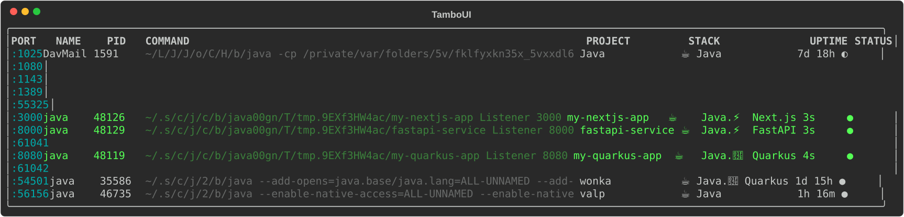
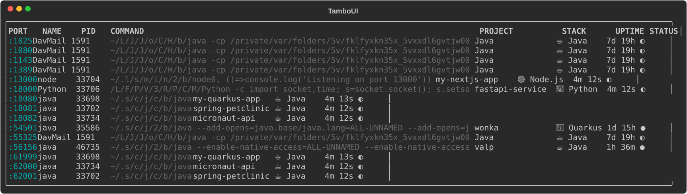
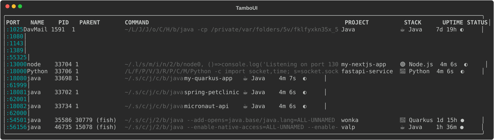
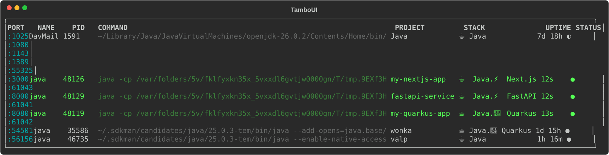

# portz

A beautiful CLI tool to inspect and manage processes listening on your machine's ports.

Java port of [port-viewer](https://github.com/iamEtornam/port-viewer) (Rust) — built with [Quarkus](https://quarkus.io), [aesh](https://github.com/aeshell/aesh), and [tamboui](https://tamboui.dev).



## Quick Start

```sh
# Run instantly via jbang (requires Java 25)
jbang portz@maxandersen

# Or with the alias
jbang ports@maxandersen
```

## Features

- **`portz`** — list listening ports with process info, framework detection, git branch
- **`portz -p <port>`** — detailed process card with kill prompt
- **`portz ps`** — process-centric view with CPU%, memory, deduped by PID
- **`portz watch`** — live monitoring with in-place redraw, ghost rows for killed processes
- **`portz clean`** — find and interactively kill orphaned/zombie dev processes
- **`portz completion`** — generate shell completions (bash, zsh, fish, pwsh)

## Usage

```sh
portz                     # list dev ports (filtered)
portz --all               # list all ports including system services
portz -p 8080             # detail view for port 8080
portz ps                  # process view with CPU/memory
portz watch               # live monitoring (Ctrl+C to exit)
portz clean               # find and kill orphaned processes
portz --no-group          # one row per port (no grouping)
portz --parent            # show parent process column
portz --no-compact        # show full binary paths
portz --save out.svg      # export as SVG
```

### Default View

By default, portz shows dev processes grouped by PID, with compact binary paths and framework detection:


### Ungrouped View (`--no-group`)

Expand grouped ports into individual rows:



### Parent Process (`--parent`)

Show which process spawned each listener:



### Full Paths (`--no-compact`)

Show full binary paths instead of compacted ones:



### SVG Export (`--save`)

Export any view as SVG for documentation or sharing:

```sh
portz --save output.svg --width 140
```

### Updating Screenshots

Run the demo script to regenerate all screenshots with live framework detection:

```sh
./screenshots/demo.sh
```

This spins up Quarkus, Spring Boot, Next.js, FastAPI, and Micronaut listeners using their real runtimes, captures all views, and saves SVGs to `screenshots/`.

## Smart Detection

### Frameworks (via `package.json`, `pom.xml`, `build.gradle`, or cmdline)

| Ecosystem | Detected Frameworks |
|---|---|
| JavaScript | ⚡ Next.js, ⚡ Vite, 🅰️ Angular, 💿 Remix, 🚀 Astro, 🚂 Express, ⚡ Fastify, 💚 Nuxt |
| Python | 🎸 Django, ⚡ FastAPI, 🌶️ Flask |
| Ruby | 🛤️ Rails, 🐆 Puma |
| Java | 🍃 Spring Boot, 🔮 Quarkus, 🔬 Micronaut |
| Other | 🐹 Go, 🦀 Rust/Cargo |

### Docker Services (via image name)

| Service | Image match |
|---|---|
| 🐘 PostgreSQL | `postgres` |
| 🔴 Redis | `redis` |
| 🍃 MongoDB | `mongo` |
| 🐬 MySQL | `mysql`, `mariadb` |
| 🌐 Nginx | `nginx` |
| 🐇 RabbitMQ | `rabbitmq` |
| 🔍 Elasticsearch | `elasticsearch` |
| 📨 Kafka | `kafka` |
| ☁️ LocalStack | `localstack` |

### Process Filtering

| Category | How it works |
|---|---|
| Dev process | Name matches: `node`, `python`, `java`, `go`, `cargo`, `ruby`, `mvn`, `gradle`, `npm`, `bun`, `deno`… or has a detected framework |
| System process | Filtered out: `Spotify`, `Chrome`, `Slack`, `Discord`, `sshd`, `launchd`… |
| IDE tooling | Filtered out: LSP servers and language tooling spawned by VS Code, IntelliJ, etc. (shown with `--all`) |
| Status ● | Healthy — has a living parent process |
| Status ◐ | Orphaned — parent is PID 1 (init/launchd) |
| Status ✕ | Zombie — finished but not reaped |

### More

- **Port grouping** — multiple ports per process collapsed into one row (`--no-group` to expand)
- **Path compaction** — `/usr/local/bin/java` → `/u/l/b/java`, `~/.sdkman/candidates/java/25/bin/java` → `~/.s/c/j/2/b/java` (`--no-compact` for full paths)
- **Watch mode** — in-place redraw, green highlight for new processes (< 60s), red ghost rows for killed processes (5s fade)
- **`NO_COLOR`** support — respects [no-color.org](https://no-color.org/) convention
- **Cross-platform** — macOS, Linux, Windows (CWD via oshi FFM)

## Install

### jbang (recommended)

```sh
jbang portz@maxandersen
```

Requires Java 25. jbang will download it automatically if needed.

### Build from source

```sh
git clone https://github.com/maxandersen/portz.git
cd portz
./mvnw package -DskipTests
java --enable-native-access=ALL-UNNAMED -jar target/quarkus-app/quarkus-run.jar
```

### Shell completions

```sh
# Auto-detects your shell
portz completion | source

# Or specify explicitly
portz completion bash > ~/.local/share/bash-completion/completions/portz
portz completion zsh > ~/.zsh/completions/_portz && compinit
portz completion fish > ~/.config/fish/completions/portz.fish
```

## Tech Stack

| Component | Role |
|---|---|
| [Quarkus](https://quarkus.io) + [aesh](https://github.com/aeshell/aesh) | CLI framework, command parsing, shell I/O |
| [tamboui](https://tamboui.dev) | ANSI-aware table rendering, InlineDisplay, SVG export, BBCode markup |
| [oshi](https://github.com/oshi/oshi) (FFM) | Windows process CWD via Foreign Function & Memory API |
| Virtual threads | Concurrent process data collection |

## Credits

Inspired by and ported from [port-viewer](https://github.com/iamEtornam/port-viewer) by [Etornam](https://github.com/iamEtornam) — a blazing-fast Rust CLI for port inspection. This Java port adds framework detection, tamboui-based rendering, port grouping, watch mode ghost rows, SVG export, and cross-platform support via standard Java APIs.

## License

MIT
